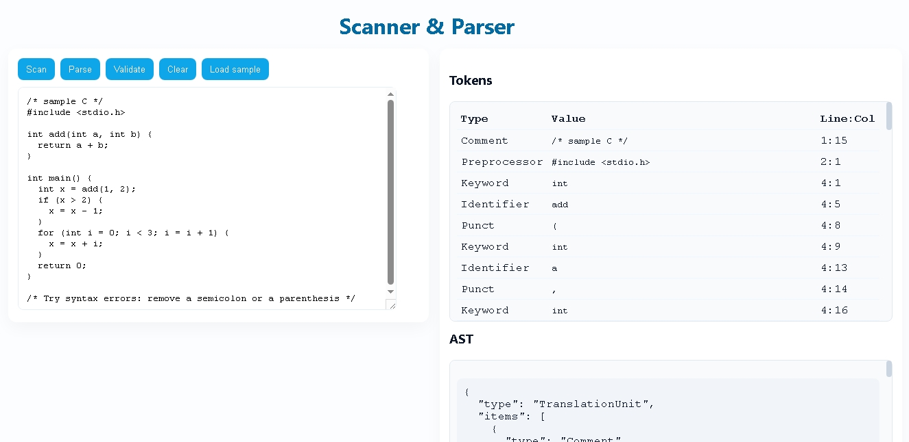

# 🧠 C Language Scanner + Parser

A complete **browser-based Scanner (Lexer) + Parser** for a simplified subset of the **C programming language**.  
Built with **HTML, CSS, and Vanilla JavaScript**, it performs:

- **Lexical Analysis** → Converts C code into tokens  
- **Parsing** → Validates syntax using a recursive-descent parser  
- **AST Generation** → Builds an Abstract Syntax Tree for valid programs  

Everything runs entirely inside the browser — no backend required.

---

## 📸 Preview

> 

---

## 🧩 Features

### 🔍 Scanner (Lexer)
- Tokenizes real **C-like syntax**
- Detects:
  - **Keywords** (`int`, `if`, `return`, `while`, ...)
  - **Identifiers**
  - **Numbers**
  - **Character literals**
  - **String literals**
  - **Operators** (`==`, `+=`, `&&`, `*`, `/`, `<`, `>=`, etc.)
  - **Punctuation** (`{}`, `()`, `;`, `,`)
  - **Preprocessor directives** (`#include`, `#define`)
  - **Comments** (`// comment`, `/* block comment */`)
- Shows:
  - Token **type**
  - Token **value**
  - **Line : Column**
- Tokens appear inside a **scrollable table**

---

### 🧠 Parser
The project includes a **recursive-descent parser** that:

- Validates syntax according to a simplified C grammar  
- Builds an **AST (Abstract Syntax Tree)**  
- Highlights **syntax errors** with:
  - Exact token
  - Line
  - Column
  - Error message explaining what happened  

Supported syntax includes:

- Function definitions  
- Variable declarations  
- Return statements  
- If / else  
- While loops  
- For loops  
- Expressions  
- Function calls  
- Array access  
- Compound statements (`{ ... }`)

AST output is shown in a clean **scrollable panel**.

