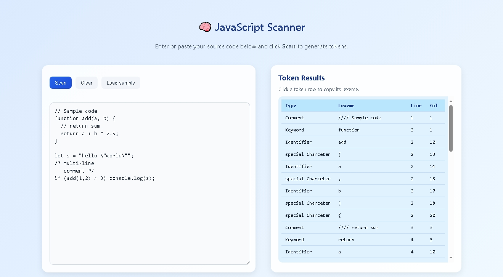

# 🧠 JavaScript Scanner / Lexer

A simple **browser-based scanner (lexer)** built with **HTML, CSS, and JavaScript**.  
It reads source code, breaks it into **tokens**, and displays each token’s **type, lexeme, line, and column** in a beautiful, modern interface.

---

## 📸 Preview

---
## 🧩 Features

- 🪄 **Real-time scanning** of JavaScript-like syntax  
- 📋 Displays tokens in a clean table (type, value, line, column)  
- 💬 Click any token row to copy its lexeme to clipboard  
- 🌈 Modern, responsive, and minimal UI  
- 🧱 Built using pure **HTML**, **CSS**, and **Vanilla JavaScript**

---

## 🧠 About the Scanner

This tool simulates how a **compiler’s lexical analysis phase** works.  
It converts your source code into a list of tokens, which are the building blocks for later compiler stages (like parsing and code generation).

### Token Types
- **Keyword** – e.g., `function`, `return`, `let`
- **Identifier** – variable or function names  
- **Number** – numeric literals  
- **String** – string literals (`"hello"`, `'world'`)  
- **Operator** – arithmetic and logical operators  
- **SpecialCharceter** – symbols like `{}`, `()`, `;`  
- **Comment** – single-line `//` or multi-line `/* ... */`  
- **Unknown** – unrecognized characters  
